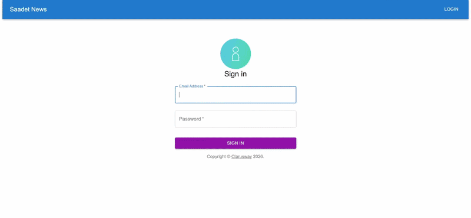

# Redux Toolkit Ornegi

<p align="center">
  
</p>

## `Kurulum`

```
npm install veya yarn
```

## `Kullanilan Kutuphaneler`

- `@reduxjs/toolkit`
- `react-redux`
- `axios`
- `react-router-dom`
- `@mui/material-ui`
- `@emotion/react`
- `@emotion/styled`

## `Kullanilan API`:
- API Provider: GNews
- Documentation: https://gnews.io/docs

## `Kullanilan Araclar`

- `Redux Dev Tools` : Chrome uzerinde calisan ve global state uzerinde yapilan tum degisikliklerin takip edilmesini saglayan tarayici uzantisidir.
